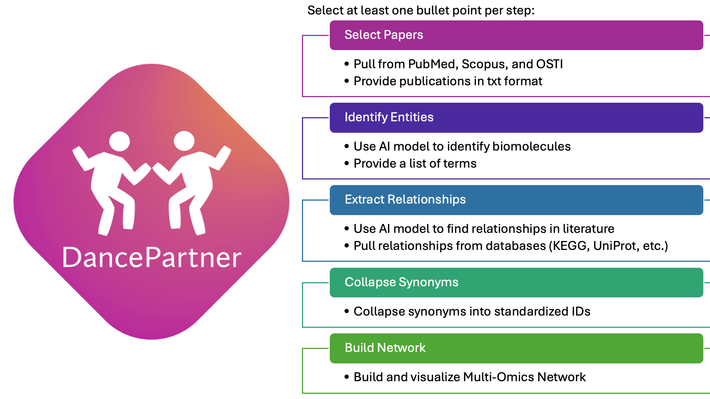

# Welcome to *DancePartner*! 



*DancePartner* is a python package which creates multi-omics networks derived from literature and databases. In these networks, each node is a biomolecule and each edge indicates a relationship between biomolecules, which can be a metabolic relationship, a binding event, or any other interaction between two biomolecules. *DancePartner* takes literature and biological databases (KEGG, Wikipathways, etc.) as inputs and outputs biomolecule relationships (the "dance partners" of other biomolecules). These networks can be visualized and used as inputs into other biological tools and technologies. 

This tool is designed with five steps with various options at each step. Users can select one or multiple options, and outputs can be combined. The steps are 1. Select Papers, 2. Identifiy Entities, 3. Extract Relationships, 4. Collapse Synonyms, and 5. Build Network. *DancePartner* has been designed to easily pull and use AI/ML models so that non-ML experts can easily pull and use these functions and methods. More details about each step are provided below. 


## Cite

*Publication coming soon* Degnan et. al. 2025

# How to Use

## Installation

To install this package, clone the repo and navigate to the directory it sits in. Then, use pip to install.

```
>>> git clone https://github.com/pnnl-predictive-phenomics/DancePartner.git
>>> cd {Directory it was installed to}
>>> pip install DancePartner/
```

## Examples 

This package contains a `vignettes/` folder with various example vignettes that walk through using this package. We suggest starting there.

* To learn how to run DancePartner from beginning to end, see [How to use DancePartner](./vignettes/how_to_use_DancePartner.ipynb)

* To learn how to pull papers from PubMed, Scopus, and OSTI, see [How to Pull Papers](./vignettes/how_to_pull_papers.ipynb)

* To learn how to extract relationships from databases, see [How to Pull from Databases](./vignettes/how_to_pull_from_databases.ipynb)

# Notes 

## Pull the BERT Model

Extract the BERT model from [here](https://huggingface.co/david-degnan/BioBERT-RE/tree/main). Place in the top level directory of this repo in a folder called "biobert". Pull the `config.json`, the `pytorch_model.bin`, and the `training_args.bin` files.

## Scopus API Key

An API key is needed to pull papers from Scopus. Instructions to obtain one can be found [here](https://dev.elsevier.com/).

## Optional ScispaCy Model

Download the `en_ner_bionlp13cg` model from [here](https://allenai.github.io/scispacy/)

## Relationships 

*DancePartner* finds relationships but does not characterize them (e.g. a metabolic relationship, an interaction event, etc.).

## Test Code Coverage 

% coverage

## Additional Stop Words

Add or modify the stop words list [here](./omes/stop_words_english.txt)

## How to Extract Paper IDs

**PubMed:** PMIDs. Enter a query into the search bar of PubMed, click “Save”, select “All results”, and output the format as “PMID”. [Link to database](https://pubmed.ncbi.nlm.nih.gov/)

**Scopus:** DOIs. Enter a query into the search bar, click “Export”, select the desired format, select all documents, and then export at least the DOI column. [Link to database](https://scopus.com)

**OSTI:** OSTI IDs. Enter a query and click “Save Results”, and the resulting file will contain the OSTI IDs. [Link to database](https://www.osti.gov/)

## Complex Query Example

Here are some examples of more complicated queries if needed:

**PubMed:** `(e coli proteomics) AND (e coli metabolism) AND (("2000/01/01"[Date - Publication]: "2024/02/23"[Date - Publication]))`

**Scopus:** `TITLE-ABS-KEY ( e AND coli AND proteomics AND e AND coli AND metabolism ) AND PUBYEAR > 20000101 AND PUBYEAR < 20240224)`

**OSTI:** `q=e coli proteomics AND e coli metabolism&publication_date_start=1/1/2000&publication_date_end=2/3/2024`
